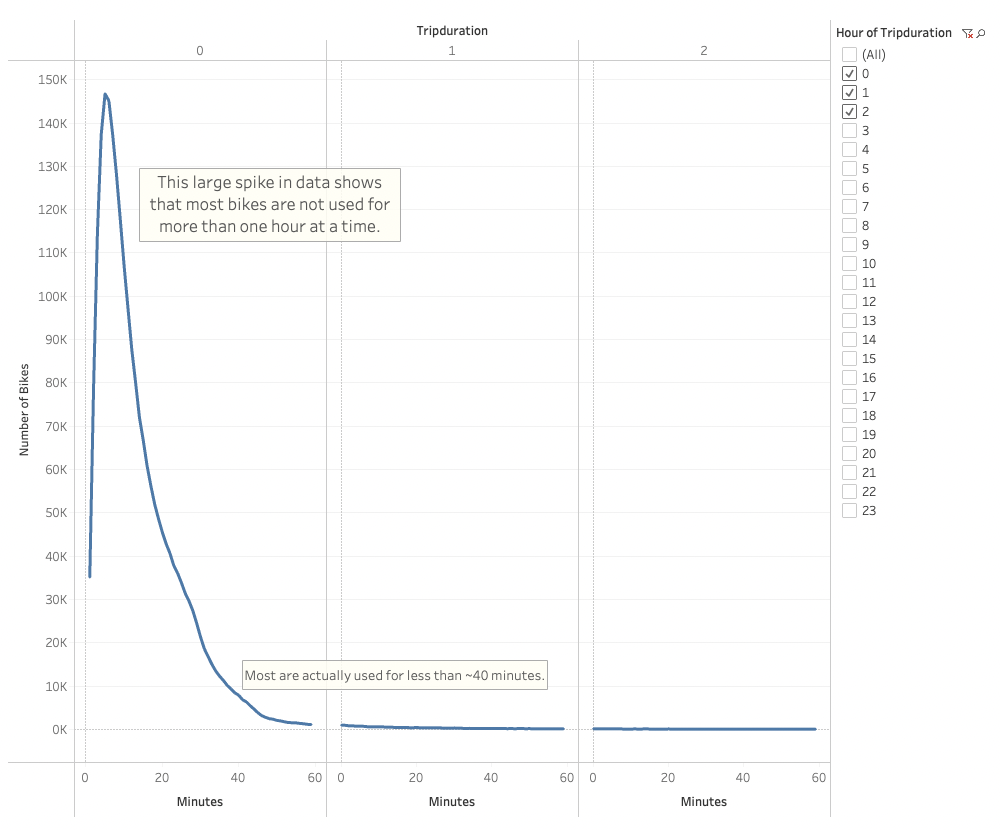
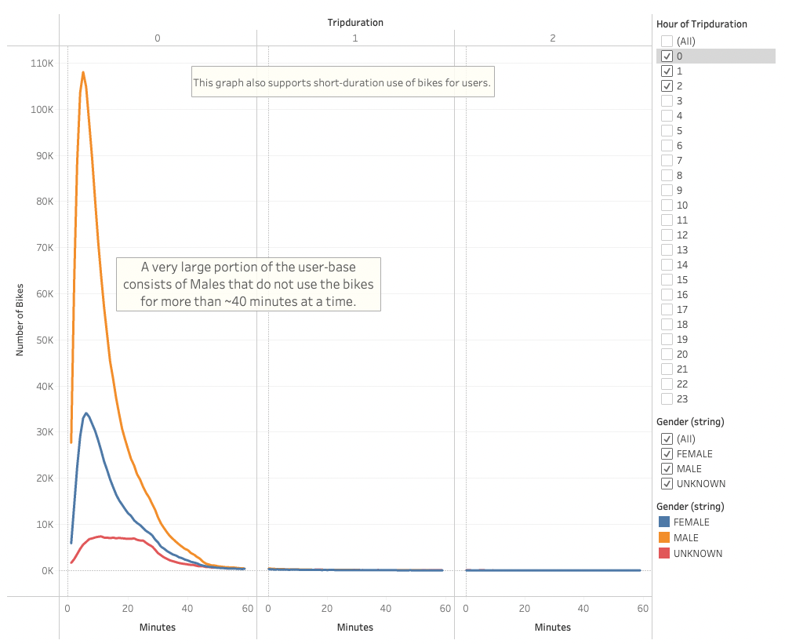
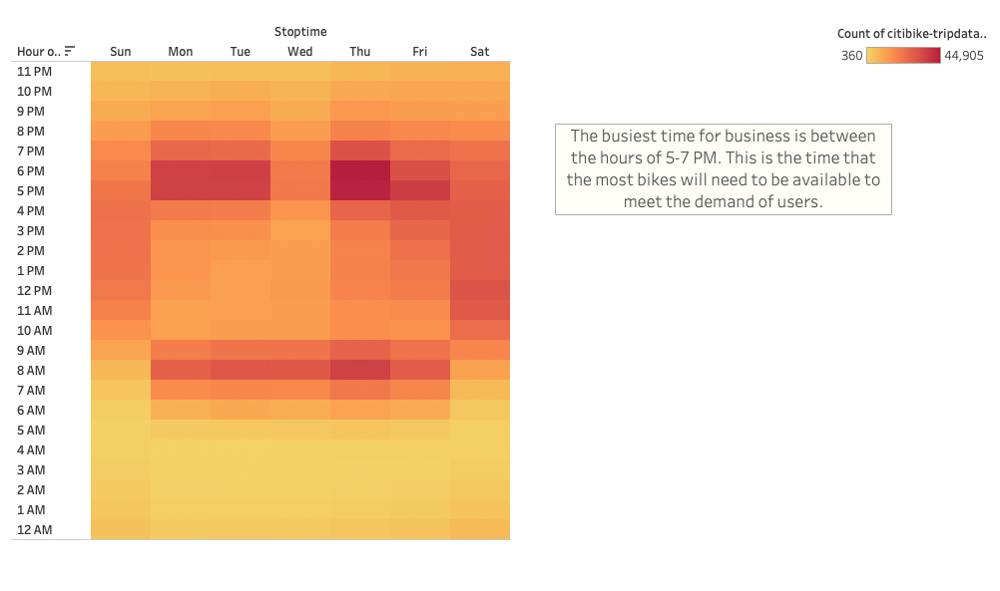
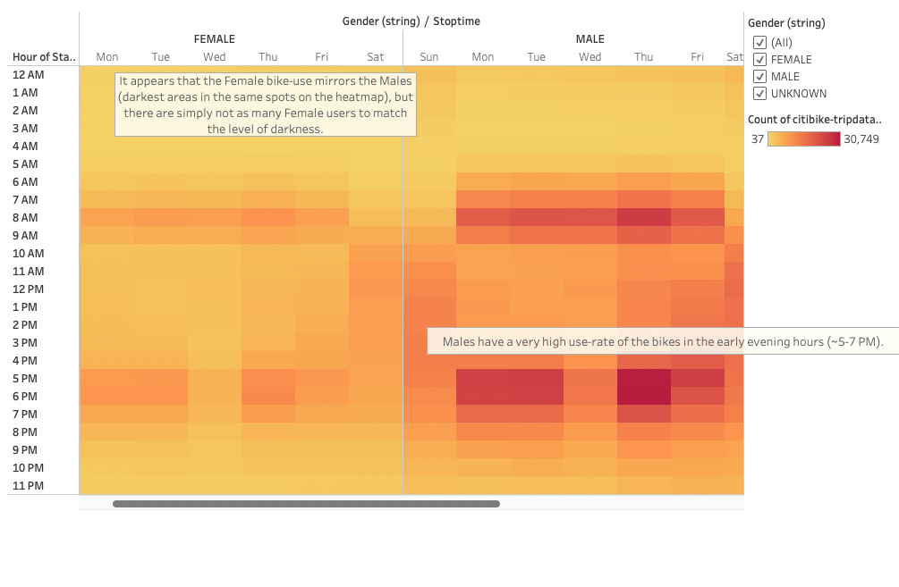
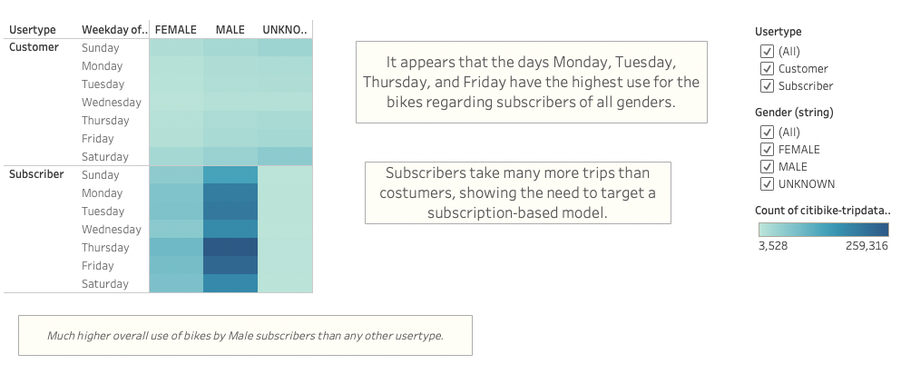
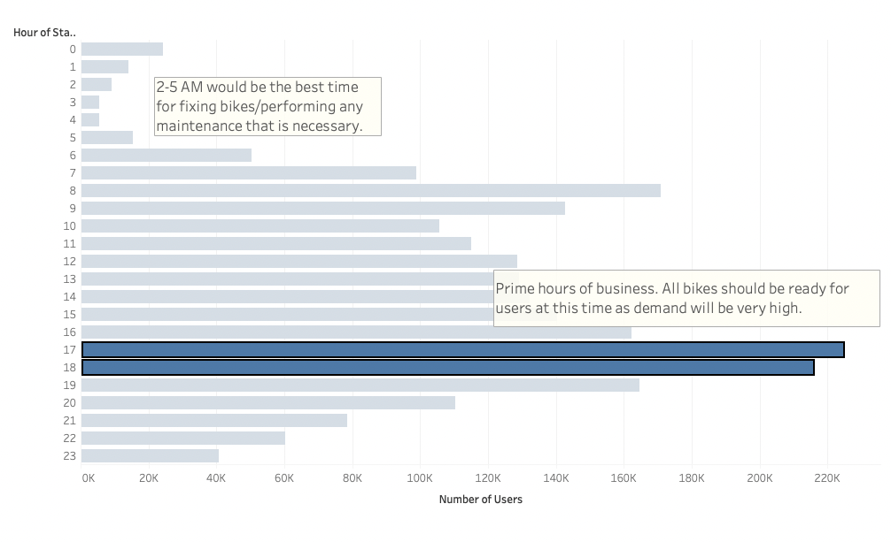
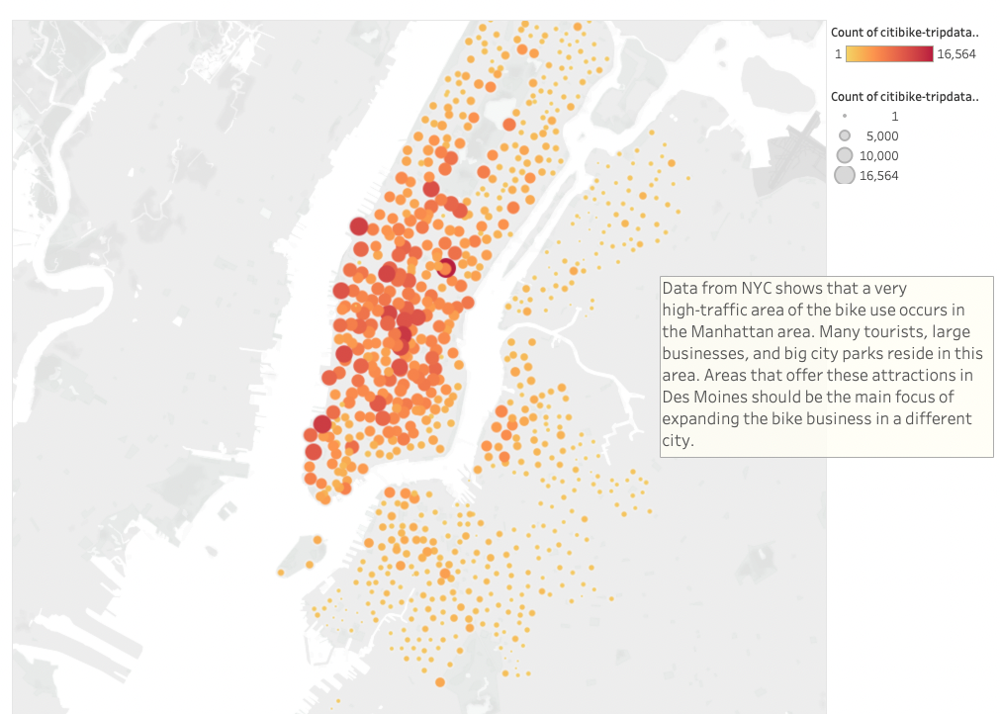

# Bikesharing - citibike proposal for Des Moines, Iowa

View these data visualizations and interact with them by following this link to the initial project on Tableau: 
[link to dashboard](https://public.tableau.com/app/profile/gwinkelman/viz/citibikechallenge_16651119660020/ChallengeStory?publish=yes)

## Purpose
This analysis was completed in order to better understand that citibike business that is very successful in NYC. Citibike data from NYC was used to guide a business proposal to create a successful bike-sharing business in Des Moines.  Tableau was used to create interactive visualizations that can be viewed in the link above. From these visualizations, a very promising business proposal was created.  

## Results
The following images show trends in the NYC data that should be applied to the Des Moines business plan.

This shows the average checkout time that users have the bikes. A very large majority of the bikes are not used for more than 40 minutes at a time.  This allows for bikes to be reused multiple times in a day by different users, if the supply of bikes remains adequate.  

The average checkout time of the bikes by gender further supports that most users do not ride for more than 40 minutes at a time.  It also shows that there is a much higher use of the citibikes by males compared to females (high orange spike of uses). 

It appears that the heaviest traffic for the bike use is between the hours of 5-7 PM.  It also appears that Mondays, Tuesdays, and Thursdays are the busiest days for business.  Lastly, the image shows that there is a spike in the bike use in the morning hours of 8-9 AM. These riders are presumably riding those bikes to work, which supports having bikes available to the residents of the metro area (and it helps the environment). 

This image shows that males use the citibikes in NYC much more than females (the spots are much darker on the 'Males' side of the heatmap.  This image also shows that although there are far fewer female users, the 3 different gender categories listed (males, females, unknown) all show the same general trip times that are the busiest.  This means that regardless of gender, there is a high demand for the bikes around the hours of 8-9 AM and 5-7 PM.  

This visual shows that male subscribers use the bikes more than any other type of user.  This heatmap also shows that subscribers take many more trips with the bikes than customers, so targeting a subscription-based business plan would create more satisfied users.  Lastly, Mondays, Tuesdays, Thursdays, and Fridays seem to be the busiest days for business.  These days are the most important to ensure enough supply of bikes for the very high demand.  Any updates, big projects, etc. that interrupt business should occur on a different day to keep the users more satisfied.  

This graph can be seen primarily in the background, displaying the peak hours for the month of August.  From the hours of 7 AM - 8 PM, there are essentially 100K+ users that are actively using the bikes.  The highlighted portion shows that the hours peak between 5-7 PM.  This is the time that will need the highest supply of bikes, and interruptions to the bike-sharing business should not occur during these times.  

The data from NYC shows that Manhattan area has the highest bike-user traffic.  This area is huge in tourism, very large business/corporations, and city parks. If any areas in Des Moines offer similar attractions to these, that should be the main focus of the business in order to satisfy the most users possible. If there are no areas that are comparable to this in Des Moines, consider areas that will benefit users with short-duration trips like to libraries, universities, parks, and other city attractions.  

## Summary
All in all, a bike-sharing business in Des Moines, Iowa should focus on these key things: 
  - Positioning bikes in areas that are short distances to city attractions. (shoot for less than 40 minute trips to these attractions)
  
  - Meeting the high demand for bikes between the hours of 5-7 PM and 8-9 AM. There will need to be the highest supply of bikes ready at these times in   order to keep user satisfaction high.  
  
  - Weekdays, especially Monday, Tuesday, Thursday, and Friday are the busiest days for business.  Avoid any interruptions to bike services on these days, and especially during the times mentioned above. 
  
  - Create a business model that targets and supports an easy-to-use, subscription-based model.  Individual customers are important for revenue and building a bigger subscription base, but keeping subscribers happy should be the driving force to growing the bike-sharing business. It is very important to target all genders in marketing attempts - although appealing to a male audience may bring more subscribers in. Hopefully marketing campaigns can figure out how to get more female users in Des Moines, and maintain the high level of male users that is seen in the NYC data.  

Two additional visualizations that I would recommend in a future analysis would be showing the start and end locations (on average) of each bike.  This would help understand if bikes are generally staying in the same locations, or if they are being taken all around the city.  Bikes in higher-use areas that stay around those areas will develop more wear-and-tear and will require more maintenance.  This visualization would help determine what efforts can be made to prevent that wear-and-tear on bikes before users become unsatisfied.  The other recommendation that I have would be to show what bike stations are the busiest (and slowest) at certain hours of the day.  This visualization would help determine the station-size needed to keep up with the demand of bikes. Slower areas can possibly have bikes taken from them that are not in use to help with high-traffic areas.  Any testing measures could be done at the slowest stations to keep users happy and interrupt the least amount of services.  
